# Informações do Projeto

`TÍTULO DO PROJETO`

> Mobilidade Urbana - Buzzão.
>
> `CURSO`
>
> Engenharia de Software - PUC Minas Praça da Liberdade.

## Participantes

> Equipe envolvida no desenvolvimento do projeto:
>
> - Arthur Capanema Bretas;
> - Guilherme Lage da Costa;
> - Renato Ramalho Teodoro de Oliveira Júnior;
> - Mateus Guanabarino Freire de Castro;
> - Miguel Magalhães Freire de Castro.

# Estrutura do Documento

- [Informações do Projeto](#informações-do-projeto)
  - [Participantes](#participantes)
- [Estrutura do Documento](#estrutura-do-documento)
- [Introdução](#introdução)
  - [Problema](#problema)
  - [Objetivos](#objetivos)
  - [Justificativa](#justificativa)
  - [Público-Alvo](#público-alvo)
- [Especificações do Projeto](#especificações-do-projeto)
  - [Personas e Mapas de Empatia](#personas-e-mapas-de-empatia)
  - [Histórias de Usuários](#histórias-de-usuários)
  - [Requisitos](#requisitos)
    - [Requisitos Funcionais](#requisitos-funcionais)
    - [Requisitos não Funcionais](#requisitos-não-funcionais)
  - [Restrições](#restrições)
- [Projeto de Interface](#projeto-de-interface)
  - [User Flow](#user-flow)
  - [Wireframes](#wireframes)
- [Metodologia](#metodologia)
  - [Divisão de Papéis](#divisão-de-papéis)
  - [Ferramentas](#ferramentas)
  - [Controle de Versão](#controle-de-versão)
- [Projeto da Solução](#projeto-da-solução)
  - [Tecnologias Utilizadas](#tecnologias-utilizadas)
  - [Arquitetura da solução](#arquitetura-da-solução)
- [Avaliação da Aplicação](#avaliação-da-aplicação)
  - [Plano de Testes](#plano-de-testes)
  - [Registros de Testes](#registros-de-testes)
- [Referências](#referências)

# Introdução

## Problema

> A utilização do meio de transporte público como principal forma de deslocamento é a realidade de grande parte da população brasileira. Em que pese a sua relevância, os seus usuários são frequentemente surpreendidos por atrasos nas linhas, alteração dos horários dos ônibus, ou até mesmo a sua superlotação, conforme relacionado em [artigo](https://portal.unit.br/blog/noticias/os-gargalos-do-transporte-publico-no-brasil/) publicado pela Universidade de Tiradentes, por exemplo. Esses eventos, imprevistos, causam diversos impactos ao planejamento das pessoas, como:
>
> - Atraso para os seus compromissos;
> - Tempo de deslocamento incerto;
> - Custo adicional com tarifas, caso haja uma opção mais barata de deslocamento.
>
> Partindo desse pressuposto, seria possível fornecer a essas pessoas uma informação clara e precisa sobre a linha de ônibus que ela deseja pegar, de modo que ela saiba exatamente onde o seu ônibus está? Essa é uma dor presente no dia a dia de muitas pessoas que dependem dessas informações para se planejarem, e que será analisada e desenvolvida no projeto a apresentado seguir.

## Objetivos

### Objetivo geral

> O objetivo geral deste projeto, é desenvolver uma plataforma web que ajude os usuários a terem um maior controle sobre a posição no qual o seu ônibus se encontra, de modo que ele saiba quanto tempo terá que esperá-lo.

### Objetivos específicos

> - Apresentar, de maneira simples, a posição em que uma determinada linha de ônibus se encontra;
> - Permitir que o usuário informe a sua localização em tempo real, por meio de GPS;
> - Fornecer o tempo de deslocamento entre a posição do usuário e o ônibus (tempo de espera).

## Justificativa

> Segundo o IPEA (Instituto de pesquisa econômica aplicada), 65% da população brasileira utiliza o transporte público como principal forma de deslocamento nas capitais. Em pesquisas realizadas pelo instituto, verificou-se que mais de 90% dos passageiros consideram que andam em ônibus lotados e esperam mais de 30 minutos nos pontos de ônibus, uma vez que os horários muitas vezes não são respeitados.
>
> Em pesquisa realizada pela própria equipe do projeto (cujos resultados podem ser verificados no [link](https://github.com/ICEI-PUC-Minas-PPLES-TI/plf-es-2022-2-ti1-7924100-mobilidade-urbana/blob/master/docs/concepcao/Pesquisa%20de%20mobilidade.pdf)), avaliamos um grupo composto em 89% por jovens de 19 a 30 anos, sendo que 68% são pessoas que utilizam o ônibus como principal meio de transporte. Desse percentual, 69% informaram que já utilizaram um aplicativo de acompanhamento de horários de ônibus, e 52% relataram terem vivenciado problemas em sua utilização, como horários incorretos, linha incorreta ou interface não intuitiva, por exemplo.

## Público-Alvo

> Com base nos dados apresentados no capítulo de Justificativa, o publico alvo do presente estudo serão homens e mulheres, com faixa etária de 19 a 30 anos, que residem em Belo Horizonte e utilizam o ônibus como o principal meio de transporte, e que possuem familiaridade com aplicativos e aplicações web no dia a dia.

# Especificações do Projeto

> Nesta seção, será apresentada uma visão mais detalhada e aprofundada do projeto em análise. Para isso, foram utilizadas das seguintes práticas:
>
> - Descrição de Personas: busca entender, em uma visão mais pessoal, as dores das pessoas relacionadas com o tema do estudo;
> - Histórias de usuários: indicação, na visão de usuários e administradores da plataforma, das funcionalidades/capacidades esperadas que podem lhe ajudar;
> - Requisitos: quais são nossos objetivos em termos de funcionalidades da plataforma (requisitos funcionais) e demais aspectos (requisitos não funcionais);
> - Restrições: definição dos limites do escopo do projeto.

## Personas e Mapas de Empatia

> Para um maior conhecimento acerca das pessoas que buscamos atingir e ajudar com esse projeto, foram realizadas entrevistas com 5 pessoas de diferentes áreas de conhecimento e grupos. Esses grupos variam desde estudantes, pessoas que estão estudando e estagiando simultaneamente, e pessoas que já se formaram, e estão inseridas no mercado de trabalho.
>
> Ademais, cabe mencionar que as entrevistas contemplaram pessoas que não necessariamente utilizam o ônibus como forma principal de deslocamento em seu dia a dia, mas que, em eventuais situações, fazem uso deste meio de transporte, como é o caso do Pedro e José Carlos. Considerando essas informações, a seguir são apresentadas as Personas mapeadas.
>
> **Lowrany Ferreira:**
>
> 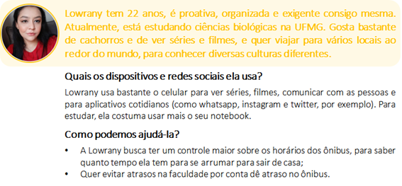
>
> **Beane do Carmo:**
>
> 
>
> **Tamara Andrade:**
>
> 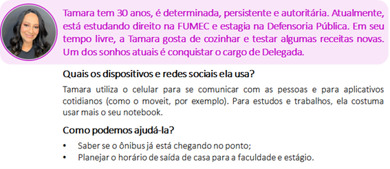
>
> **Pedro Guerra:**
>
> 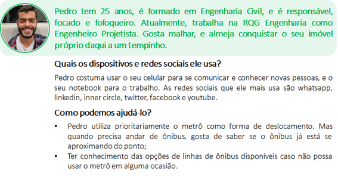
>
> **José Carlos:**
>
> 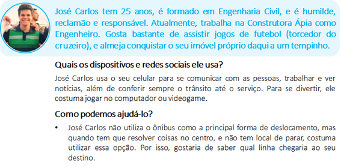

## Histórias de Usuários

> Com base na análise das personas apresentadas acima, foram identificadas as seguintes histórias de usuários:
>
> | Eu como... _PERSONA_ | Quero/preciso... _FUNCIONALIDADE_                       | Para... _MOTIVO/VALOR_                                                         |
> | -------------------- | ------------------------------------------------------- | ------------------------------------------------------------------------------ |
> | Usuário              | Visualizar o custo da passagem do ônibus                | Saber qual opção será mais econômica                                           |
> | Usuário              | Ver a posição do ônibus em um mapa                      | Ter uma melhor noção da sua localização real                                   |
> | Usuário              | Salvar as linhas favoritas                              | Facilitar a visualização das linhas mais utilizadas                            |
> | Usuário              | Informar a minha localização pelo GPS                   | Ter maior praticidade na hora de usar a aplicação                              |
> | Usuário              | Saber o tempo de espera estimado até um ônibus chegar   | Saber quando sair de casa e ir para o ponto                                    |
> | Usuário              | Poder enviar feedbacks sobre o site                     | Contribuir com pontos que podem ser benéficos a outros usuários                |
> | Administrador        | Ter acesso às funcionalidades da API MapBox             | Apresentar, em mapa, a posição de um ônibus                                    |
> | Administrador        | Ter acesso às informações disponibilizadas pela BHtrans | Construir base de dados que será utilizada pela API MapBox                     |
> | Administrador        | Verificar a relação de contas existentes                | Ter maior controle sobre a taxa de crescimento do site em números de usuários. |

## Requisitos

> Com base nas pesquisas realizadas pela equipe, foram mapeados os principais requisitos (funcionais e não funcionais) detalham o escopo do projeto.

### Requisitos Funcionais

> | ID     | Descrição do Requisito                                             | Prioridade |
> | ------ | ------------------------------------------------------------------ | ---------- |
> | RF-001 | Permitir que o usuário salve o número da linha                     | ALTA       |
> | RF-002 | Apresentar as linhas de ônibus salvas pelo usuário                 | ALTA       |
> | RF-003 | Mostrar a posição do ônibus no mapa                                | ALTA       |
> | RF-004 | Apresentar o tempo de espera estimado do ônibus                    | MÉDIA      |
> | RF-005 | Permitir que o usuário informe como localização o local atual dele | MÉDIA      |
> | RF-006 | Apresentar a localização do usuário no mapa                        | MÉDIA      |
> | RF-007 | Possuir um banco de dados com os preços das tarifas dos ônibus     | MÉDIA      |
> | RF-008 | Apresentar tarifa do ônibus selecionado pelo usuário               | BAIXA      |
> | RF-009 | Receber informação quanto à ocupação do ônibus                     | BAIXA      |
> | RF-010 | Mostrar taxa de ocupação do ônibus para o usuário                  | BAIXA      |

### Requisitos não Funcionais

> | ID      | Descrição do Requisito                                                                                | Prioridade |
> | ------- | ----------------------------------------------------------------------------------------------------- | ---------- |
> | RNF-001 | O usuário deve ser capaz de verificar a posição do ônibus, mesmo sem fornecer a sua localização atual | ALTA       |
> | RNF-002 | A opção de favoritar linhas deve ser indicada no momento de pesquisa do usuário                       | ALTA       |
> | RNF-003 | O sistema precisa ser executado tanto em desktops quanto dispositivos móveis                          | MÉDIA      |
> | RNF-004 | O tempo para apresentação da linha do ônibus não pode ser superior a 5 segundos                       | MÉDIA      |
> | RNF-005 | A interface deve possuir uma opção de layout claro e escuro                                           | BAIXA      |

## Restrições

> O projeto em análise será restrito pelos itens apresentados conforme tabela a seguir.
>
> | ID  | Restrição                                                                    |
> | --- | ---------------------------------------------------------------------------- |
> | 01  | O projeto deverá ser entregue até o final do semestre letivo da universidade |
> | 02  | Não pode ser desenvolvido um módulo de back-end                              |
> | 03  | Não podem ser feitos aportes financeiros no projeto                          |

# Projeto de Interface

> Pensando em uma forma mais dinâmica de se utilizar o sistema projetado e na praticidade necesária, foi desenhada uma interface com um conceito 'clean'. Ou seja, são necessários poucos cliques para que o usuário consiga a informação que deseja. A principal razão para isso são os cenários nos quais o usuário pode utilizar o Buzzão, seja enquanto se arruma para sair de casa ou anda na rua, por exemplo.
>
> Neste sentido, a seguir são detalhados o userflow do site e os wireframes projetados.

## User Flow

> A seguir é detalhado o user flow elaborado para o projeto, considerando as premissas acima informadas.
>
> 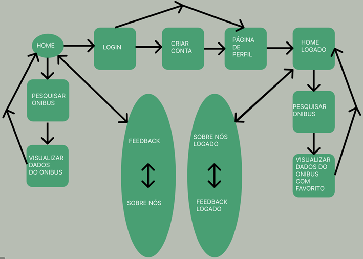
>
> Para uma melhor visualização, este fluxo pode ser acessado por meio do seguinte [link](https://www.figma.com/proto/cZuvPXMTUubx1HkE5WLvpg/Buzz%C3%A3o---Wireframes?node-id=303%3A139&scaling=scale-down-width&page-id=0%3A1&starting-point-node-id=303%3A139).

## Wireframes

> A seguir é detalhado os wireframes elaborados para o projeto.
>
> **Página inicial:**
>
> 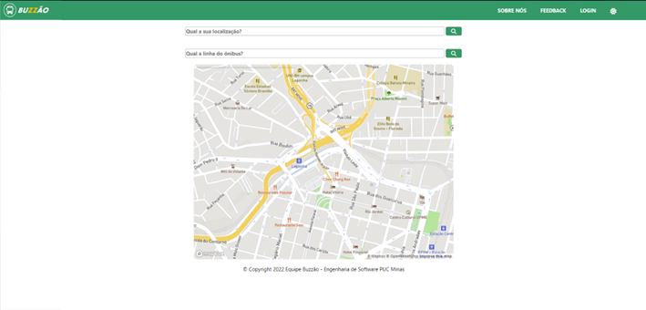
>
> **Página sobre nós:**
>
> 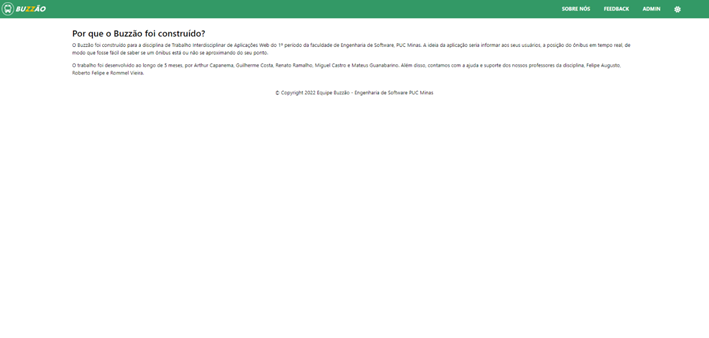
>
> **Página de login:**
>
> 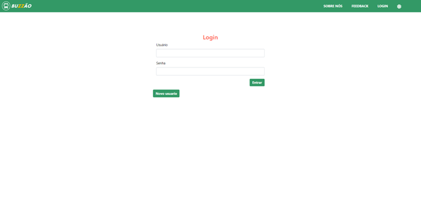
>
> **Página de perfil:**
>
> 
>
> **Página de feedback:**
>
> 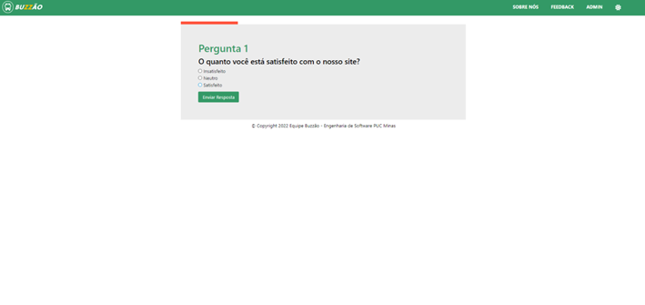
>
> Para uma melhor visualização, o protótipo interativo da página pode ser acessado pelo seguinte [link](https://www.figma.com/proto/cZuvPXMTUubx1HkE5WLvpg/Buzz%C3%A3o---Wireframes?node-id=303%3A139&scaling=scale-down-width&page-id=0%3A1&starting-point-node-id=303%3A139).

# Metodologia

> A equipe utilizou o Design Thinking em todo o processo de entendimento do problema. Por meio dele, foi possível definir o objetivo, os mapas de personas e as histórias de usuários. Além disso, foram utilizadas diversas práticas do SCRUM, como reuniões diárias, divisão do grupo por funções, ficando a cargo de cada integrante a seleção das tarefas que ele iria realizar. Utilizamos também um fluxo de revisão, no qual cada integrante da equipe deveria revisar o que foi feito pelos demais componentes.
>
> Para a distribuição das atividades, utilizamos a metodologia KANBAN, dessa forma foi possível visualizar as atividades mais urgentes, as que demandavam mais tempo e dedicação, e o que cada componente estava trabalhando no momento. Esse método contribuiu diretamente para a realização do projeto de forma fluida e ágil.
>
> De modo a fornecer uma visão mais detalhada dos processos realizados pela equipe, apresenta-se a seguir os capítulos de 'divisão de papéis' e 'ferramentas'.

## Divisão de Papéis

> A tabela a seguir demonstra a equipe integrante do projeto e suas respectivas funções.
>
> | Membro             | Função                       |
> | ------------------ | ---------------------------- |
> | Guilherme Lage     | Desenvolvedor e Scrum Master |
> | Renato Ramalho     | Desenvolvedor                |
> | Miguel Magalhães   | Desenvolvedor                |
> | Mateus Guanabarino | Desenvolvedor                |
> | Arthur Capanema    | Desenvolvedor                |
> | Felipe Augusto     | Product owner                |
> | Roberto Felipe     | Product owner                |
> | Rommel Vieira      | Product owner                |
>
> Conforme supramencionado, para realizar a divisão das atividades entre a equipe, adotamos a metodologia KANBAN, em que cada um dos componentes escolhe as atividades que deseja fazer. A figura a seguir ilustra a divisão de tarefas do projeto, que pode ser consultado por meio deste [link](https://github.com/orgs/ICEI-PUC-Minas-PPLES-TI/projects/76/views/1).
>
> Para fins de acompanhamento, as atividades foram agrupadas nas seguintes categorias: (i) backlog; (ii) in process; (iii) in review; e (iv) done, cada uma com suas características, sendo elas:
>
> - 📋 Backlog: são as atividades que serão desenvolvidas ao longo da sprint;
> - 🏗 In progress: atividades em andamento pela equipe;
> - 👀 In review: categoria composta pelas atividades finalizadas, mas que estão no processo de revisão;
> - ✅ Done: atividades concluídas e revisadas, prontas para entrega;
> - 🗑 Canceled: atividades canceladas (categoria criada para fins de controle geral).
>
> A imagem a seguir ilustra algumas das atividades realizadas pela equipe, dsitribuídas no KANBAN.
>
> 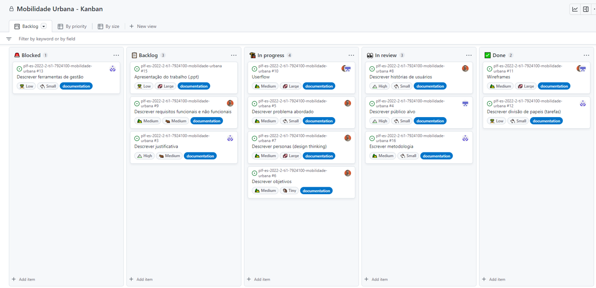

## Ferramentas

> As ferramentas utilizadas no ao longo do processo foram:
>
> | Ambiente                               | Plataforma         | Link de acesso                                                                                                                                                                 |
> | -------------------------------------- | ------------------ | ------------------------------------------------------------------------------------------------------------------------------------------------------------------------------ |
> | Processo de Design Thinking            | Miro               | [Desing Thinking](https://miro.com/app/board/uXjVPUYNSag=/?share_link_id=41463230586)                                                                                          |
> | Repositório online                     | GitHub             | [Repositorio Github](https://github.com/ICEI-PUC-Minas-PPLES-TI/plf-es-2022-2-ti1-7924100-mobilidade-urbana)                                                                   |
> | Controle de versões                    | Git                | [Git](https://git-scm.com/)                                                                                                                                                    |
> | Acompanhamento das atividades - Kanban | GitHub Projects    | [Kanban](https://github.com/orgs/ICEI-PUC-Minas-PPLES-TI/projects/76/views/1)                                                                                                  |
> | Protótipo Interativo - Wireframe       | Figma              | [Wireframe](https://www.figma.com/proto/cZuvPXMTUubx1HkE5WLvpg/Buzz%C3%A3o---Wireframes?node-id=303%3A139&scaling=scale-down-width&page-id=0%3A1&starting-point-node-id=303%3A139) |
> | Fluxo de páginas - Userflow            | Figma              | [Userflow](https://www.figma.com/file/cZuvPXMTUubx1HkE5WLvpg/Buzz%C3%A3o---Wireframes?node-id=359%3A119&t=wNzh6DEyYJAK5iqj-0)                                                                                          |
> | Editor de código                       | Visual Studio Code | [Visual Studio Code](https://code.visualstudio.com/)                                                                                                                           |
> | Comunicação                            | Discord e Whatsapp | -                                                                                                                                                                              |
>
> As ferramentas listadas foram utilizadas ao longo de todo o processo de desenvolvimento, por conta de sua praticidade na utilização e reconhecimento no mercado.

# Projeto da Solução

> Este capítulo se dedica a apresentar as tecnologias utilizadas para o desenvolvimento deste projeto, e como elas interagem entre si.

## Tecnologias Utilizadas

> As tecnologias utilizadas para o desenvolvimento da aplicação foram:
>
> | Descrição     | Categoria                                    |
> | ------------- | -------------------------------------------- |
> | HTML          | Linguagem de marcação                        |
> | CSS           | Linguagem de estilização                     |
> | JavaScript    | Linguagem de programação                     |
> | Bootstrap     | Framework                                    |
> | Map Box       | API                                          |
> | Directions    | MapBox plug-in                               |
> | Git           | Software de versionamento                    |
> | GitHub        | Controle compartilhado de versões do projeto |
> | GitHub Pages  | Hospedagem da aplicação Web                  |
> | Visual Studio | IDE                                          |
>
> Assim que o usuário entra na página inicial da aplicação, ele pode informar o seu local atual pelo GPS e qual linha de ônibus que deseja verificar. Para que essas informações fossem passadas para um mapa, foi usada a API MapBox, em paralelo com o plug-in Directions, que permite a inserção de pontos iniciais e finais de destino.
>
> 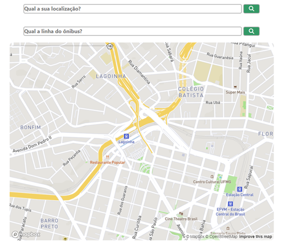
>
> Após inserção das informações indicadas, elas serão indicadas no mapa, pelos pontos A e B, respectivamente. Além disso, um card, com as informações de linha, tempo de deslocamento e preço da tarifa, será apresentado. Caso a linha indicada pelo usuário não esteja em nosso banco de dados, ele pode solicitar a sua inclusão, por meio da página de Feedback. O acesso a essa página pode ser feito no momento em que a linha de ônibus é informada, por meio de um modal, ou pelo próprio menu horizontal.
>
> 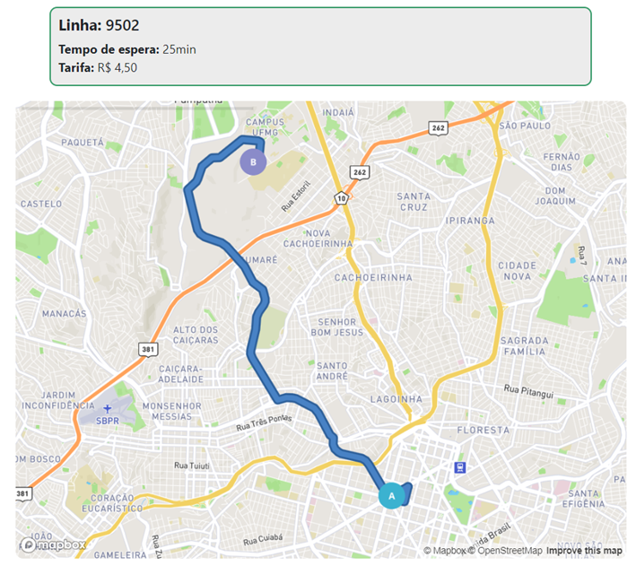
>
> Caso o usuário esteja logado enquanto usa a aplicação, o que pode ser feito por meio da página de Login, indicada no menu horizontal, será apresentada a opção de favoritar uma determinada linha de ônibus, que será inserida no card no momento de pesquisa da linha. As linhas que forem favoritadas pelo usuário podem ser conferidas na página de perfil, bem como os comentários dos feedbacks realizados. Para que isso fosse possível, foram utilizados o localStorage e sessionStorage.
>
> 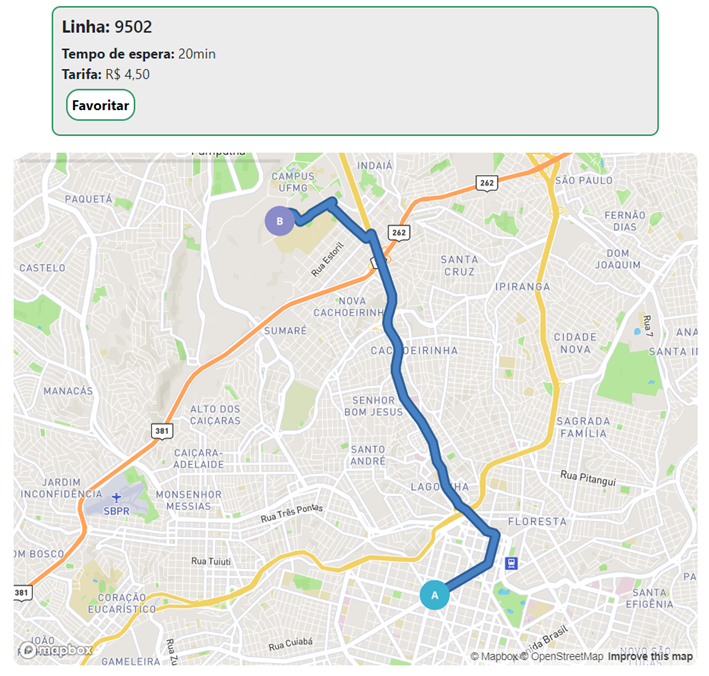

## Arquitetura da solução

> A arquitetura da aplicação desenvolvida segue o modelo ilustrado na figura a seguir.
>
> 
>
> Conforme ilustrado pela figura acima, a aplicação web foi desenvolvida a partir das linguagens HTML, CSS e JavaScript. Para armazenamento e gerenciamento das informações dos usuários cadastrados, foram utilizados o localStorage e sessionStorage.
>
> Para o posicionamento de uma determinada linha de ônibus e localização do usuário em um mapa, foi utilizada a API MapBox, em conjunto com seu plug-in Directions. Esse plug-in é responsável pelo reconhecimento de 2 localizações como pontos de início e término de um trajeto, além de calcular o tempo médio para seu deslocamento.
>
> A aplicação completa está sendo publicada por meio da funcionalidade de Pages do GitHub.

# Avaliação da Aplicação

> Nesta sessão, serão indicados os cenários de testes elaborados pelo grupo a fim de verificar a adequação das funcionalidades desenvolvidas frente aos requisitos supra apresentados. A elaboração destes cenários foi de suma importância para que falhas na experiência do usuário fossem verificadas.

## Plano de Testes
> | ID  | Cenário analisado                                                                                                                                                                                                                                                                                                                                                                                                    | Requisitos de referência |
> | --- | -------------------------------------------------------------------------------------------------------------------------------------------------------------------------------------------------------------------------------------------------------------------------------------------------------------------------------------------------------------------------------------------------------------------- | ------------------------ |
> | 1   | `Favoritar linha de ônibus e visualizá-la na página de perfil`   Passo a passo: `1.` Fazer login. `2.` Abrir página inicial (home). `3.` Pesquisar linha de ônibus e clicar no botão de pesquisa. `4.` Clicar no botão "favoritar". `5.` Abrir página de perfil.  `Resultado esperado:` A linha favoritada pelo usuário deve ser mostrada no card de favoritos, em sua área de perfil. | RF-001 e RF-002          |
> | 2   | `Inserir linha de ônibus e visualizá-la no mapa`   Passo a passo: `1.` Abrir página inicial (home). `2.` Pesquisar linha de ônibus. `3.` Clicar no botão de pesquisa.  `Resultado esperado:` A linha informada pelo usuário deve ser mostrada no mapa.                                                                                                                                       | RF-003                   |
> | 3   | `Inserir localização do usuário pelo GPS e visualizá-la no mapa`   Passo a passo: `1.` Abrir página inicial (home). `2.` Clicar na barra de pesquisa de localização do usuário. `3.` Clicar no botão de pesquisar.  `Resultado esperado:` A localização do usuário informada deve ser mostrada no mapa.                                                                                      | RF-005 e RF-006          |
> | 5   | `Ver tempo estimado do ônibus`   Passo a passo: `1.` Abrir página inicial (home). `2.` Clicar na barra de pesquisa de localização do usuário. `3.` Clicar no botão de pesquisar. `4.` Pesquisar linha de ônibus. `5.` Clicar no botão de pesquisa.  `Resultado esperado:` O tempo de deslocamento entre a posição do usuário e do ônibus deve ser apresentada no card.                 | RF-004                   |
> | 6   | `Visualização do preço da tarifa do ônibus`   Passo a passo: `1.` Abrir página inicial (home). `2.` Pesquisar linha de ônibus. `3.` Clicar no botão de pesquisa.  `Resultado esperado:` O preço da linha digitada deve ser apresentado no card.                                                                                                                                              | RF-007 e RF-008          |
>
> Com relação aos requisitos funcionais RF-009 e RF-010, o componente da equipe responsável pelo seu desenvolvimento não as entregou como previsto. De modo que eles foram desconsiderados do plano de teste, conforme orientação dos professores.

## Registros de Testes

> O Plano de Teste foi realizado com 7 participantes, sendo que 5 deles já conheciam o objetivo do projeto (participaram da etapa de personas), e 2 que ainda não conheciam, conforme listados a seguir.
>
> Já conheciam a aplicação:
>
> - Lowrany Ferreira;
> - Beane do Carmo;
> - Tamara Andreda;
> - Pedro Guerra;
> - Jose Carlos.
>
> Não conheciam a aplicação:
>
> - Matheus Lage;
> - Rodrigo Lage.
>
> Todos esses testes foram realizados considerando a metodologia caixa preta (quando o testador não conhece/interage com o código), os testes caixa branca (quando o testador conhece/interage com o código) foram realizados pelos próprios componentes da equipe. Ademais, os participantes foram instruídos a realizarem os 6 cenários descritos no Plano de Testes, sem que vissem o passo a passo indicado, de modo a avaliar a real clareza da aplicação para o usuário.
>
> Com base nos testes realizados, verificamos que, de modo geral, todos os usuários apresentaram facilidade para navegar pela aplicação e realizar todos os 7 cenários previstos no Plano de Testes. Segundo os intrevistados, a interface mais simplificada é um dos principais pontos positivos, que facilita a navegabilidade da aplicação.
>
> Dentre os pontos de melhoria apresentados, foram citadas as seguites funcionalidades: (i) as linhas favoritadas na página de perfil, quando clicadas, poderiam levar à página inicial, já às adicionando na busca; (ii) alerta (notificação) em sistemas mobile, quando o ônibus estivesse se aproximando; e (iii) ver os pontos de ônibus no mapa. Não foram detectadas falhas significativas no funcionamento da aplicação durante o processo de testagem.

# Referências

> PEDUZZI, Pedro. Título: Estudo do Ipea mostra que 65% da população usam transporte público nas capitais. Agência Brasil, 2022. Disponível em: [link](https://memoria.ebc.com.br/agenciabrasil/noticia/2011-05-04/estudo-do-ipea-mostra-que-65-da-populacao-usam-transporte-publico-nas-capitais#:~:text=Bras%C3%ADlia%20%E2%80%93%20Um%20estudo%20divulgado%20hoje,p%C3%A9%20no%20dia%20a%20dia). Acesso em: 19 de setembro de 2022.
>
> ASSCOM, Grupo Tiradentes. Título: Os gargalos do transporte público no Brasil. Universidade Tiradentes, 2022. Disponível em: [link](https://portal.unit.br/blog/noticias/os-gargalos-do-transporte-publico-no-brasil/). Acesso em: 24 de setembro de 2022.
